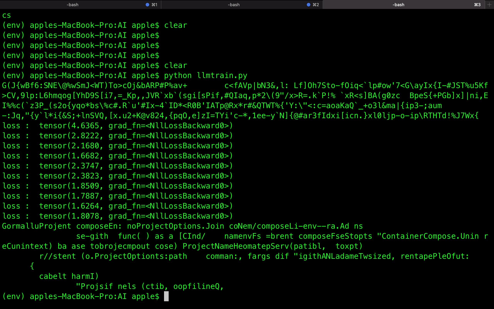

# LLMTransformer
# This is a very basic Transformer based LLM model implemented using Attention is all you need paper.

# File Descriptions
1. TransformerllmModel.py    [[        The model        ]]
2. llmtrain.py               [[        Training code        ]]
3. gotext.txt                [[        Sample data to train and test model        ]]

Here I have shown a simple text generating llm model.You can train this model using any text you want.I ran it on my machine on a cpu and with this current configurations I was abe to reduce loss up to 1.6264.

Here is my training loss

